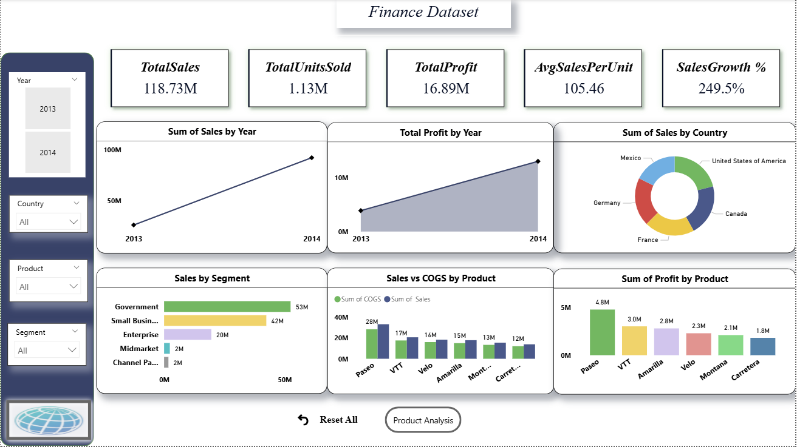
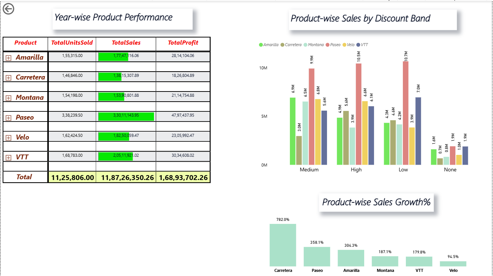

# Financial Data Analysis Dashboard

## Project Overview
This project presents an interactive Power BI dashboard built using a financial dataset. It analyzes sales, profit, and product performance across segments, countries, and years to provide actionable business insights.

## Objective
To analyze financial performance and provide actionable insights for business decision-making using interactive dashboards.

## Tools Used
- Power BI – Dashboard creation and visualization
- Excel / CSV – Data preparation

## Dataset
The dataset includes:
- Segment, Country, Product
- Units Sold, Sales, Cost of Goods Sold (COGS), Profit
- Discount Band, Sales Price, Manufacturer Price
- Year (2013–2014), Month, and Month Name

## Key Features
- Interactive KPIs for total sales, total units sold, total profit, AverageSalesPerUnit and Sales Growth%.
- AverageSalesPerUnit: Measures average revenue per unit sold
- Sales Growth%: Shows the growth in sales compared to previous period
- Product-wise and segment-wise performance analysis
- Trend analysis over months and years
- Insights into discount bands and their effect on sales
- Visualizations to support **data-driven decision-making**

## Dashboard Preview

## Dataset
[Click here to view the dataset](Finance_dataset.xlsx)

## Dashboard Preview

### Overview

### Product Analysis

## How to Use
1. Open the dashboard in Power BI to interact with the visuals.
2. Explore filters to analyze different segments, products, and countries.
3. Use KPIs and charts to identify trends and make business decisions.

## Outcome
- Provides clear insights into financial performance
- Helps understand sales and profit patterns across products and regions
- Useful for decision-making and performance evaluation
